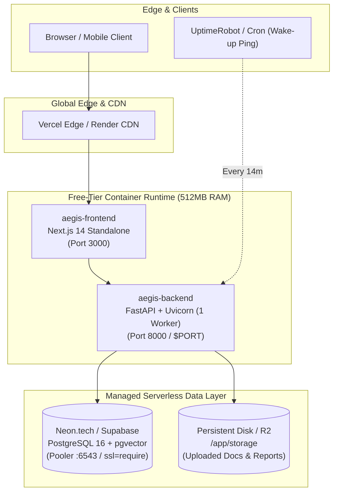

# AEGIS AI — Free-Tier Cloud Deployment Guide

This operational guide provides step-by-step instructions for deploying the **AEGIS AI** autonomous operations platform to production using **100% free-tier cloud infrastructure**.

---

## 1. Cloud Architecture Topology

AEGIS AI can be deployed on zero-cost free tiers using either an **All-in-One Render Blueprint** or an optimized **High-Performance Hybrid Stack** (Neon + Render/Railway + Vercel).



---

## 2. Free-Tier Cloud Providers Matrix

| Component | Recommended Provider | Free Tier Allocation | Notes |
| :--- | :--- | :--- | :--- |
| **Database** | **Neon.tech** | 0.5 GiB storage, unlimited branching, built-in pgvector | **Permanent free tier**; does not expire. Built-in connection pooling (`-pooler`). |
| **Alternative DB**| **Supabase** | 500 MB storage, 2 free projects, pgvector included | Free tier pauses after 7 days of inactivity. |
| **Render DB** | **Render PostgreSQL** | 1 GB storage | Render free database expires after 30 days. Recommended for quick demos. |
| **Backend API** | **Render Web Service** | 750 free instance hours/month, 512 MB RAM, 0.1 CPU | Spins down after 15 min inactivity; wakes up in 30-45s. |
| **Alternative API**| **Railway Starter** | $5 monthly trial credit (~500 hrs) | Ultra-fast builds; handles Dockerfiles natively. |
| **Frontend UI** | **Vercel** / **Render** | Unlimited deployments, global edge network | Vercel provides instant cold-start-free Next.js rendering. |
| **Document Storage**| **Render Disk** / **Cloudflare R2** | 1 GB disk on Render / 10 GB free on R2 | R2 offers S3-compatible zero-cost egress. |

---

## 3. Option A: 1-Click Render Blueprint Deployment

Render provides Infrastructure as Code via `render.yaml` located in the root of the repository.

### Step 1: Push Code to GitHub
Ensure your repository is pushed to GitHub or GitLab:
```bash
git add .
git commit -m "feat: complete free-tier cloud deployment configuration"
git push origin main
```

### Step 2: Create Blueprint on Render
1. Log in to [Render Dashboard](https://dashboard.render.com/).
2. Click **New +** $\to$ **Blueprint**.
3. Connect your GitHub repository containing AEGIS AI.
4. Render will detect `render.yaml` and parse:
   - **`aegis-db`**: PostgreSQL 16 database.
   - **`aegis-backend`**: FastAPI backend service using `Dockerfile.backend`.
   - **`aegis-frontend`**: Next.js 14 frontend service using `Dockerfile.frontend`.
5. Under environment variables for `aegis-backend`, enter your **`LLM_API_KEY`** (e.g., your Google Gemini API key).
6. Click **Apply**. Render will automatically build the images, spin up the database, and wire up internal URLs.

---

## 4. Option B: High-Performance Hybrid Stack (Recommended)

To avoid Render's 30-day database expiration and ensure zero cold starts on the frontend, the **Neon + Render + Vercel** combination is the recommended production architecture:

### Step 1: Provision Free PostgreSQL with pgvector on Neon.tech
1. Create a free account at [Neon.tech](https://neon.tech).
2. Create a project named `aegis-ai` (PostgreSQL 16).
3. In the Neon SQL Editor, execute:
   ```sql
   CREATE EXTENSION IF NOT EXISTS vector;
   ```
4. Copy the **Pooled Connection String** (`Connection pooling` toggle ON):
   ```text
   postgres://[user]:[password]@[ep-name]-pooler.us-east-2.aws.neon.tech/neondb?sslmode=require
   ```
   *Note: AEGIS AI automatically normalizes `postgres://` to `postgresql+asyncpg://` and translates `sslmode=require` to `ssl=require` for asyncpg.*

### Step 2: Deploy Backend on Render
1. In Render, click **New +** $\to$ **Web Service**.
2. Select your repository.
3. Choose **Docker** runtime:
   - **Dockerfile Path**: `Dockerfile.backend`
   - **Docker Context**: `.`
4. Select the **Free** instance type (512 MB RAM).
5. Set the following Environment Variables:

| Variable | Value / Description |
| :--- | :--- |
| `APP_NAME` | `AEGIS AI` |
| `APP_ENV` | `production` |
| `HOST` | `0.0.0.0` |
| `PORT` | `8000` |
| `WORKERS` | `1` *(Crucial: 1 worker stays within 512 MB RAM)* |
| `DATABASE_URL` | *Your Neon pooled connection string* |
| `DATABASE_URL_SYNC` | *Your Neon pooled connection string* |
| `SECRET_KEY` | *Generated 64-character hex string* |
| `JWT_SECRET` | *Generated 64-character hex string* |
| `LLM_PROVIDER` | `gemini` *(or `mock` for demo mode)* |
| `LLM_MODEL` | `gemini-1.5-flash` |
| `LLM_API_KEY` | *Your Gemini API Key* |
| `CORS_ORIGINS` | `https://your-frontend.vercel.app,http://localhost:3000` |
| `RATE_LIMIT_ENABLED` | `true` |
| `DB_POOL_SIZE` | `5` |
| `DB_MAX_OVERFLOW` | `2` |

6. Set the **Health Check Path** to `/api/v1/health`.
7. Click **Create Web Service**. Note the assigned URL (e.g. `https://aegis-backend.onrender.com`).

### Step 3: Deploy Frontend on Vercel
1. Log in to [Vercel](https://vercel.com).
2. Click **Add New...** $\to$ **Project** and import your repository.
3. Set **Root Directory** to `frontend`.
4. Framework Preset: **Next.js**.
5. Configure Environment Variables:
   - `NEXT_PUBLIC_API_URL`: `https://aegis-backend.onrender.com/api/v1`
6. Click **Deploy**. Vercel will build and assign a global production edge domain (e.g., `https://aegis-ai.vercel.app`).
7. Update the backend's `CORS_ORIGINS` on Render to include your Vercel production URL.

---

## 5. Free-Tier Optimization & Cold-Start Mitigation

### Mitigating Inactivity Sleep (Render Free Tier)
Render's free web services spin down after 15 minutes of inactivity. When a new request arrives, it takes ~30–45 seconds to spin up.

To keep your free instance warm during working hours:
1. Create a free account on [UptimeRobot](https://uptimerobot.com/) or [cron-job.org](https://cron-job.org/).
2. Add a new **HTTP(s) Monitor**:
   - **URL**: `https://aegis-backend.onrender.com/api/v1/health`
   - **Monitoring Interval**: Every `14 minutes`
   - **Expected Status**: `200 OK`
3. This sends a lightweight `GET` request every 14 minutes, keeping the container warm and responsive with zero cloud hosting cost.

### 512MB RAM Optimization Rules
Render and Railway free tiers allocate 512 MB of RAM:
1. **Single Worker**: Always set `WORKERS=1` in production. Two or more workers running scikit-learn or report generation concurrently can trigger an Out-Of-Memory (OOM) kill.
2. **Connection Pooling**: Neon serverless databases support connection pooling through pgbouncer. Set `DB_POOL_SIZE=5` and `DB_MAX_OVERFLOW=2` to ensure client connection limits are never exceeded.
3. **Embeddings**: In resource-constrained environments, use `EMBEDDING_PROVIDER=gemini` or `EMBEDDING_PROVIDER=local` with `all-MiniLM-L6-v2` (only ~80MB footprint).

---

## 6. Preflight Verification CLI

Before deploying, run the included deployment verification script locally:

```bash
# Run automated preflight verification
bash scripts/deploy_cloud.sh
```

Or verify with pytest:
```bash
python -m pytest tests/unit/test_cloud_deployment.py -v
```

---

## 7. Production Health & Post-Deployment Checklist

Once deployed, verify all endpoints using curl:

```bash
# 1. Check backend readiness and database connection
curl -I https://aegis-backend.onrender.com/api/v1/health
# Returns HTTP 200 OK: {"status":"healthy","database":"connected"}

# 2. Check frontend health probe
curl -I https://aegis-frontend.onrender.com/api/health
# Returns HTTP 200 OK: {"status":"healthy","service":"aegis-frontend"}

# 3. Check Prometheus metrics endpoint
curl -s https://aegis-backend.onrender.com/api/v1/observability/metrics | head -n 10

# 4. Verify CORS preflight headers
curl -H "Origin: https://aegis-frontend.onrender.com" \
     -H "Access-Control-Request-Method: POST" \
     -H "Access-Control-Request-Headers: Content-Type,Authorization" \
     -X OPTIONS https://aegis-backend.onrender.com/api/v1/auth/login
```
